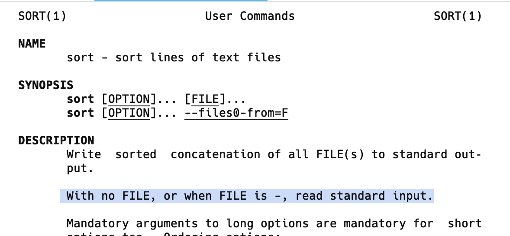
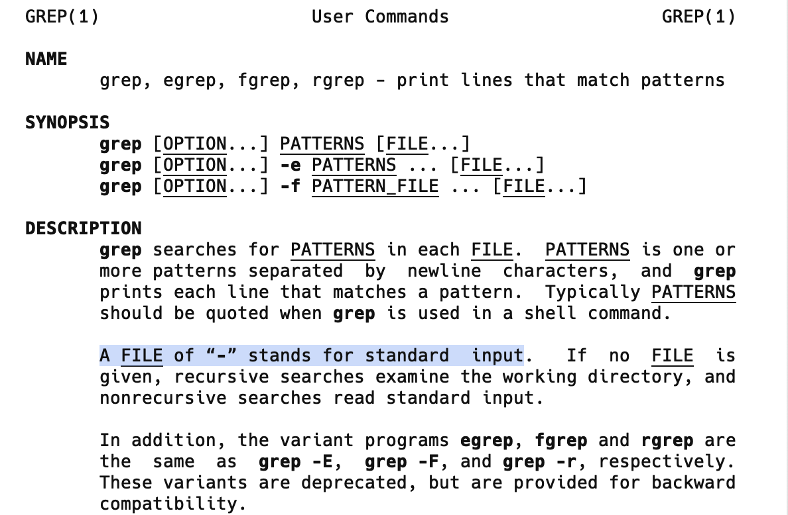
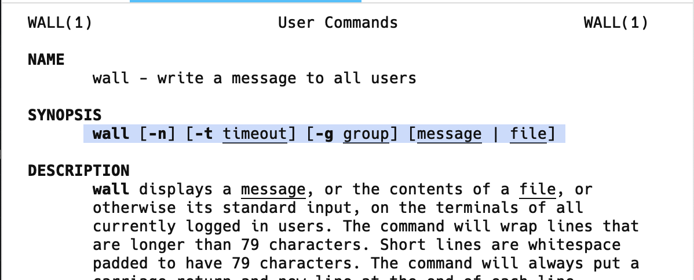
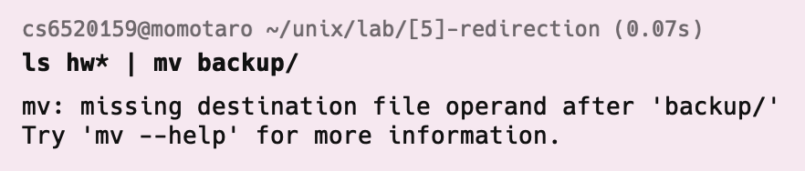
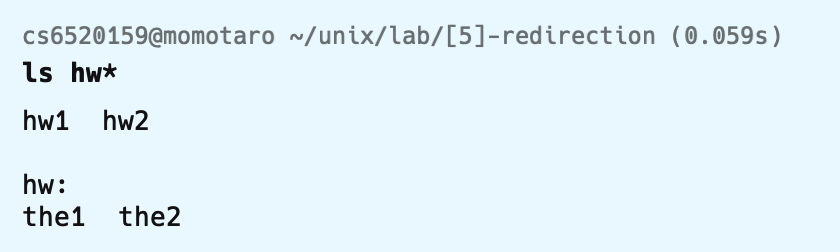
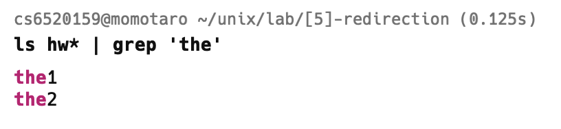

ส่งข้อ...
คำถาม 5.4 Q11
คำถาม 5.5 Q14 a, Q15, Q16

## item 8. 
ในการสั่งงานปกติ คําสั่งติดต่อกับสภาพแวดล้อมภายนอกทาง Standard Stream ซึงอาจมีครบทั้ง

Stream หรือไม่ขึ้นกับหน้าที
ของคําสัง หากใช้ Standard Input และ Standard Output เป็นเกณฑ์การ แบ่งกลุ่มคําสั่งจะแบ่งกลุ่มได้ดังนี


| A                                                                                                                                | B                                                                                                                                              | C                                                                                                               |
| -------------------------------------------------------------------------------------------------------------------------------- | ---------------------------------------------------------------------------------------------------------------------------------------------- | --------------------------------------------------------------------------------------------------------------- |
| กลุ่มคําสังที มีหน้าทีในการจัดการระบบไฟล์ซึ่งไม่สามารถควบคุมได้ทั้ง `Standard Input ` และ `Standard Output` เช่น `mkdir`,  `cp`, `rm` , `mv` เป็นต้น | กลุ่มคําสั่งทีทําหน้าที่แสดงข้อมูลของระบบปฏิบัติการซึงไม่สามารถควบคุม `Standard Input` **แต่สามารถควบคุม** `Standard Output` เช่น `ls`, `last`, `who`, `find` เป็นต้น | กลุ่มคําสั่งทีทําหน้าที่ประมวผลข้อมูล ซึ่งสามารถควบคุมได้ทั้ง `Standard  Input` และ `Standard Output` เช่น `cat`, `wc`, `nl` เป็นต้น |

จงจำเเนกคำสั่งต่อไปนี้ ว่าเป็นคำสั่งกลุ่มใด
|     |         | A   | B     | C     |
| --- | ------- | --- | ----- | ----- |
| a.  | grep    |     |       | [ x ] |
| b.  | id      |     | [ x ] |       |
| c.  | netstat |     | [ x ] |       |
| d.  | alias   |     |       | [ x ] |
| e.  | bzip2   |     | [ x ] |       |
| f.  | tar     |     | [ x ] |       |
| g.  | uniq    |     |       | [ x ] |
| h.  | ps      |     | [ x ] |       |
| i.  | diff    |     | [ x ] |       |
| j.  | sort    |     |       | [ x ] |
| k.  | tty     |     | [ x ] |       |
| l.  | top     |     | [ x ] |       |
| m.  | ping    |     | [ x ] |       |
| n.  | wall    |     |       | [ x ] |


note :
`tty` ใช้ในการบอกชนิดของ Terminal ที่ใช้งานในปัจจุบัน

```
tty
/dev/pts/8
```

</br>

### วิธีการจำเเนก

สำหรับกลุ่มคำสั่ง C ที่ประมวลผลข้อมูล เราสามารถใช้วิธีการ 

1. man เข้าไปยังคำ่สั่งนั้น เพื่อตรวจสอบดูว่า มีการรับ `Standard Input` ไหม 

  <figure>

<figcaption>  ตัวอย่าง คำสั่ง  `sort` ที่มีการบอก หากไม่มี file จะรับเป็น standard input</figcaption>
</figure>

2. หากเป็นเป็นคำสั่งที่สามารถรับ `standard input` เช่น คำสั่ง `cat`, `Unix` จะต้องรอให้เรากรอก string เข้าไป นั้นถือว่าเป็นการรับ `stdin` เเล้ว

3. สำหรับกลุ่มคำสั่ง `A ` จะเป็นจำพวก คำสั่งที่ไม่มีการเเสดง `stdoutput` ออกมา ไม่นับ `stderror` เช่น 
  "
  `cd ` เรา กรอก `arguement` เข้าไปเเต่จะไม่เกิดการ `output` กลับมา ไม่มีการบอกว่า success or not เเต่จะบอก `error`  หากไม่มี `destination`
  "
4. สำหรับ `B` จะมี `stdoutput` ปรากฎขึ้นมา เเต่จะไม่มีการรับ `stdinput` ผ่าน Keyboard โดยสิ่งที่รับจะเป็น `Arguement`
<hr/>

## Q11 คำสั่งรับข้อมูล

คําสั่งรับข้อมูลเข้าไปทํางานได้

รูปแบบคือรับผ่านคีย์บอร์ด (Standard Input) หรือรับผ่านไฟล์

Arguments ให้ยกตัวอย่างคําสั่งทีรับข้อมูลเข้าได้ทั้งรูปแบบ มาคําสั่ง

| Command | Proof                                 |
| ------- | ------------------------------------- |
| Sort    |        |
| Grep    |  |
| Wall    |  |


<hr/>

## Q14 คำสั่งต่อไปนี้ต่างกันอย่างไร

a.
``` c++

command 1 : grep 'cs' | nl > wList

vs

command 2 : nl | grep 'cs' > wList
```

**answer**
|             | command 1                                                                                              | command 2                                                                                                    |
| ----------- | ------------------------------------------------------------------------------------------------------ | ------------------------------------------------------------------------------------------------------------ |
| explanation | grep `cs` จะ return `line` นั้นเมื่อ มี `cs` อยู่ใน `line` ส่งผลลัพธ์ไปให้ `nl` นับ `line` เเละบันทึกลงในไฟล์ `wList` | ทำการรับ Input ทุกบรรทัด list เป็นเลขตาม `line` จากนั้นทำการกรอง หา `line` ที่มี `cs` เเล้วจึงบันทึก `[line_number]string ` |
| input       | ```j j j cs```                                                                                         | ```j j j cs```                                                                                               |
| cat `wList` | 1 cs                                                                                                   | 4 cs                                                                                                         |


<hr/>

b. 

``` c++
command 1 : who | nl | grep 'cs'

vs 

command 2 : who | grep 'cs' | nl
```

|             | command 1                                                                                                       | command 2                                                                |
| ----------- | --------------------------------------------------------------------------------------------------------------- | ------------------------------------------------------------------------ |
| explanation | ทำการลิสต์ `user` ที่ `login ` อยู่ขณะนี้ -> นำมา `list line ` -> นำมากรอง `cs pattern` ส่งผลให้ `line number` อาจจะกระโดดได้ | ลิสต์รายชื่อ `user` ที่ล็อกอิน ณ ปจบ -> กรองหา `line` ที่มี `cs` -> ใส่เลขหน้า `line` |

เป็นเพียงเเค่ลำดับการ execute command ที่ต่างกัน

<hr/>

## Q15 Explain
จงอธิบายการทำงาน เเละเเสดงเหตุผลหากมีข้อผิดพลาด

``` c++


commadn : a) mkdir hw | ls -ld
command : b) ls hw* | mv backup
command : c) ls hw* | grep 'the'

```

|             | command a                                              | command b                                                                                                                                                                     | command c |
| ----------- | ------------------------------------------------------ | ----------------------------------------------------------------------------------------------------------------------------------------------------------------------------- | --------- |
| explanation | make director hw -> `list` `directory` ที่อยู่ปจบ          | <span style =" color: red">error</span>  เพราะ `mv` เป็นคำสั่งประเภท `B` ที่ไม่มีการรับ `stdin` การ `pipe` เข้า `mv` จึงไร้ค่า เเละ `mv backup` ที่ขาด `destination` จึงเป็นคำสั่งกำพร้า หรือไม่สมบูรณ์ |    ทำการ `list file & director` ที่ขึ้นต้นด้วย `hw` $\xrightarrow{ส่งผลลัพธ์}$ นำมากรอง pattern ที่มี `the`       |
| output      | ``` drwxr-xr-x 12 cs6520159 std 4096 Aug 16 17:28 .``` | |  $\downarrow$                                          |

<hr/>

## Q16
จากข้อ 10)b หากต้องการเก็บผลลัพธ์เอาไว้ตรวจภายหลังต้องทำอย่างไร

| before  |  after |
|---|---|
|  `find /home "*.po"` | find /home "*.po"` >readLater `  |
|`find /home “*.po” \| nl`| find /home “*.po” \| nl `>readlater`|
|`find /home “*.po” \| ls-l \| nl`| find /home “*.po” \| ls-l \| nl `>readlater`|
|`find /home “*.po” 2>err.log \| nl`|find /home “*.po” 2>err.log \|  nl`>readLater`|
|`find /home “*.po” 2>/dev/null \| nl`|  find /home “*.po” 2>/dev/null \| nl `>readLater` |


