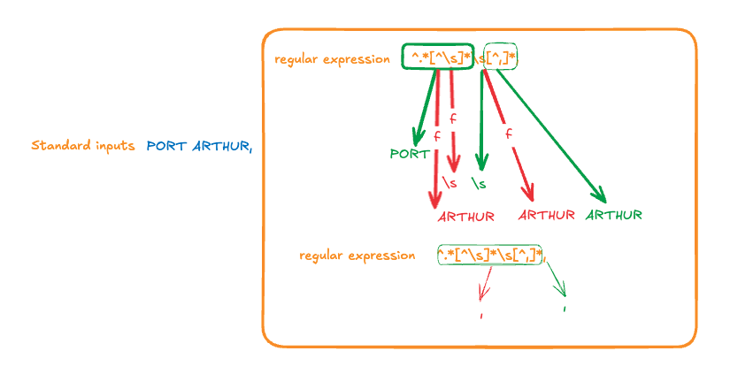

# Assignment 8

1. regex

```bash
grep '^.*[^ ]*\s[^,]*,'  avgtemp.dat 
```


1. The difference between non-space city and space is `\s`. 
2. The end of the city field close with `,`.
3. The city field is the first field.

so we anchor regex with `^` to let it match the occurence that is beginning of the line.

And the first syllable can be any character and as much as it want so we use `. dot (any character)` with `* (asterisk)`.

It will repeat checking it self until found `\s white space`.

and then it will use `[^,]*,` to check second syllable until it meet `,` at the end of the first field.




<hr>

2. show the line that have a duplicate average temperature.

```bash
grep '\(|[^|]*|\)[^\1]*\1' avgtemp.dat 
```


<hr>

3. display only city field which avg is below 30 degree.

```bash
 grep '[1-2][0-9][^|]*\|-[0-9]\+[^|]*' avgtemp.dat | cut -w -f 1
 ```

<hr>

4. show file  name that contain owner name in it.

```bash
ls -l | tail +2 | awk '{if($9 ~ $3){print $0}}'
```

<hr>

5. grep url file

```bash
grep '[^/]*$' url-file
```

<hr>

6. find the line that is not start with `202.44`


```bash
grep -v '202.44.40' last-log 

-v, --invert-match
              Invert the sense of matching, to select non-matching lines.

```

<hr>

7. Display line number that contain `a` in a word.


8. Remove all number in the line that have character more than 3.

```bash
sed '/.\{3,\}/s/[0-9]//g'
```

9. Remove the line that have numeric and character more than 3.
```bash
sed '/.\{3,\}/s/.*[0-9].*//g'
```

11.


<hr>

## AWK

### use for 
1. gen report
2. data malipulate

### varialble
```bash
$n : n is field number seperate by '\s'
NR : count line 
NF : count of field
FS : field seperator, default is '\s'
RS  : record seperator '\n'
```