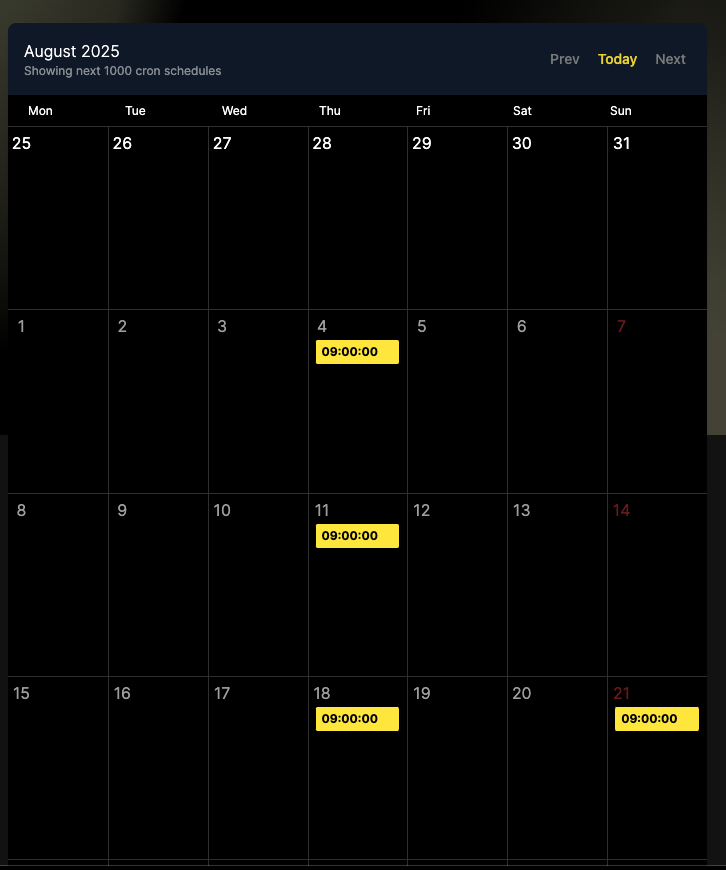

# Q27 การตั้งค่า `*/n` หมายถึงอะไร

answer : หมายถึง `command` จะถูกรันทุก ๆ `n` หน่วยเวลา ขึ้นอยู่ลำดับที่วาง

```
*/n * * * * command;
```

ถ้าอยู่ตำเเหน่งเเรกก็จะเป็นการบอกว่า ให้รันคำสั่งทุก ๆ`n` นาที โดยเริ่มที่ 1 หากเป็น เดือน เเละวัน

หากเป็นนาที เเละชม จะเริ่มที่ 0

<hr>

# Q28: ถ้าตั้งวันเวลาเป็น จะหมายถึง “วันพฤหัสบดีที 21 เดือนกันยายน เวลา : เท่านั้น **ถูกหรือผิด**

answer : มีความหมายว่า เอาวันที่ 21 หรือ วันพฤหัสบดี ของเดือน 9



<hr>

# Q29 บอกความหมาย

| crontab  | meaning  |
|---|---|
| 01 04 1 1 1  |  4:01 ของวันที่ 1 หรือ วันจันทร์ ในเดือน January เท่านั้น |
| 01 04 * * * | 4:01 ของทุกวัน |
| 01,31 04,05 1-15 1,6 * | 05:01,05:31 เเละ 04:01, 04:31 ของวันที่ 1 - 15 ในเดือน 1,6 |
|5 0 * * *| 0:05 ของทุกวัน|
|15 14 1 * 6,7| 14:15 วันที่ 1 ของทุกเดือน เเละ วัน เสาร์ อาทิตย์ ของทุกเดือน|
| 0 22 * * 1-5| 22:00 ทุกวัน เเละเดือน เเต่จะเอาเเค่วันจันทร์ ถึงศุกร์|
|17 9-16/2 * * *| ทุก 9:17, 11:17, 13:17, 15:17 ทุกวัน|
|5 4 * * sun| 04:05 ทุกวันอาทิตย์ ของทุกเดือน|
|0 0,12 1 */2 *| 0:00 เเละ 12:00 ทุกวันที่ 1 เดือน ทุก 2 เดือน 1,3,5,...,13|
| */2 * * *| ทุก 2 นาที เริ่มต้นจาก 00:00 จน 24:00 ของทุกวันทั้งปี|
|0 */2 * * *| ทุก 2 ชม เริ่มจาก 00:00 ทุกวันทั้งปี|
| 0 0 1 1 *| 00:00 วันที่ 1 เดือน january เท่านั้น (หากมี day of week กำหนด จะรวมถึงวันนั้นด้วย เช่น 0 0 1 1 1 ก็จะเอาวันจันทร์ เเละวันที่ 1 ของเดือน January ไป)|
|0 0 * * *| 00:00 ของทุกวัน ทั้งปี|
|0 0 * * 5| 00:00 ของวันศุกร์ เท่านั้น ทั้งปี|
|0 0 1 4,8 *| 00:00 วันที่ 1 เดือน 4,8 |
| 0 0 1 4-8 *| 00:00 วันที่ 1 เดือน `ถึง` 8 |
|0 9-12 */3 4-7| 9:00 10:00 11:00 12:00 ทุก 3 เดือน เริ่มจาก January + 3 + 3 เมื่อขึ้นปีใหม่ ก็เริ่มนับที่ January วันที่ 9-12 เเละ วัน พฤหัสบดี - วันอาทิตย์|


# Q30
crontab -e เเล้ววาง command นี้

answer 
```
*/30 9-16 * * * echo "$(date) : $(who | wc -l)" >>user.log
```